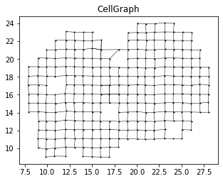
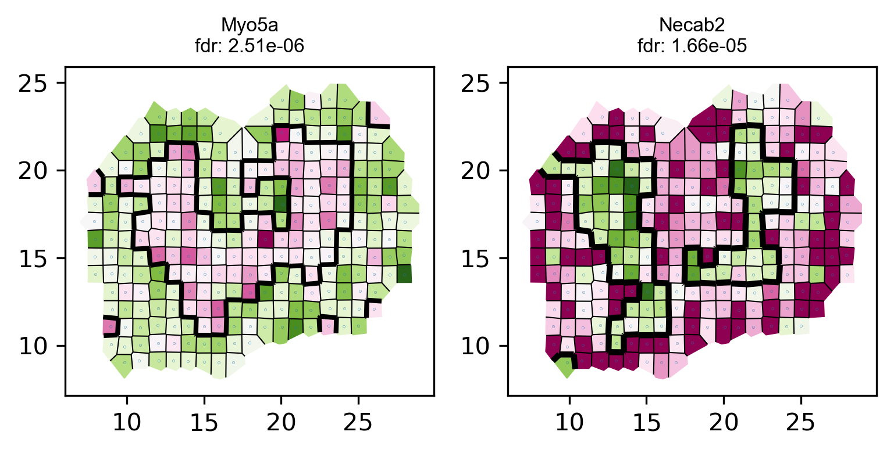

## Single-cell Graph Cuts Optimization   

## **(scGCO)**

### Overview

**scGCO** is a method to identify genes demonstrating position-dependent differential expression patterns, also known as spatially viable genes, using the powerful graph cuts algorithm. ScGCO can analyze spatial transcriptomics data generated by diverse technologies, including but not limited to single-cell RNA-sequencing, or *in situ* FISH based methods.What's more, scGCO can easy scale to millions of cells.

### Repo Contents

This repository contains source codes of scGCO, and tutorials on running the program.


### Installation Guide

The primary implementation is as a Python 3 package, and can be installed from the command line by

```python
 pip install scgco
```

**scGCO** has been tested on Ubuntu Linux (18.04.1), Mac OS X (10.14.1) and Windows(Windows 7 Professional).

### License
MIT Licence, see LICENSE file.


###  Authors
See AUTHORS file.

### Contact
For bugs, feedback or help please contact Peng Wang <wangpeng@picb.ac.cn>.

## Example usage of scGCO

The following codes demonstrate the typical data analysis flow of scGCO.

The tutorial has also been provided as a Jupyter Notebook in the **Tutorial** directory ([scGCO_tutorial.ipynb](/code/Tutorial/scGCO_tutorial.ipynb))

The entire process should only take 1-2 minutes on a typical desktop computer with 8 cores.

### Input Format
The required matrix format is the ST data format, a matrix of counts where spot coordinates are row names and the gene names are column names. This default matrix format (*.TSV* ) is split by tab.


As an example, let’s analyze spatially variable gene expression in Mouse Olfactory Bulb using a data set published in [Ståhl et al 2016](http://science.sciencemag.org/content/353/6294/78). 

### Identify spatial genes with scGCO


```python

from scGCO import *
import pandas as pd
import numpy as np
import matplotlib
import matplotlib.pyplot as plt
%matplotlib inline
```


```python
import warnings
warnings.filterwarnings('ignore')
```

## Tutorial with Rep11 of MOB 
### This is a step-by-step instruction on running the main functionalities of scGCO.
* <font size=4><mark>Step 1-5:</mark> perform genome-scale identification of spatially variably genes. </font>
* <font size=4><mark>Step 6-7:</mark> visualize and save identified spatial variably genes.</font>
* <font size=4><mark>Step 8:</mark> perform graph cuts on a single genes to visualize its spatial patterns.</font>


## **Step 1:**

### **Read in raw data and perform standard normalization.**


```python
j=11
unary_scale_factor=100
label_cost=10
algorithm='expansion'
ff = 'README_file/Rep'+str(j)+'_MOB_count_matrix-1.tsv'
locs,data=read_spatial_expression(ff,sep='\t',num_exp_genes=0.01, num_exp_spots=0.05, min_expression=1)

data_norm = normalize_count_cellranger(data)
print('Rep{}_processing: {}'.format(j,data_norm.shape))
```

    raw data dim: (262, 16218)
    Rep11_processing: (259, 12522)
    

## **Step 2:**  

### Create complete undiected graph with connecting spatial spots/cells 


```python
exp= data_norm.iloc[:,0]
cellGraph= create_graph_with_weight(locs, exp)
```


```python
fig, ax= plt.subplots(1,1,figsize=(5,5)) #, dpi=300)
ax.set_aspect('equal')

exp= data_norm.iloc[:,0].values
cellGraph = create_graph_with_weight(locs, exp)
ax.scatter(locs[:,0], locs[:,1], s=1, color='black')
for i in np.arange(cellGraph.shape[0]):
    x = (locs[int(cellGraph[i,0]), 0], locs[int(cellGraph[i,1]), 0]) 
    y = (locs[int(cellGraph[i,0]), 1], locs[int(cellGraph[i,1]), 1])     
    ax.plot(x, y, color='black', linewidth=0.5)
    
plt.title('CellGraph')
```


    Text(0.5, 1.0, 'CellGraph')





## **Step3:**
### Gene expression classification via Gaussian mixture modeling


```python
t0=time.time()
gmmDict= multiGMM(data_norm)
print('GMM time(s): ', time.time()-t0)
```

    100%|████████████████████████████████████████████████████████████████████████████████████| 8/8 [01:13<00:00,  9.15s/it]
    

    GMM time(s):  74.15773129463196
    


```python
# store_gmm(gmmDict,fileName='')
```

## **Step 4:**  


### **Run the main scGCO function to identify genes with a non-random spatial variability**


```python

t0= time.time()
result_df= identify_spatial_genes(locs, data_norm, 
                                               cellGraph ,gmmDict)
print('Running time: {} seconds'.format(time.time()-t0))

```

    100%|████████████████████████████████████████████████████████████████████████████████████| 8/8 [01:51<00:00, 13.97s/it]
    

    Running time: 112.93512773513794 seconds
    

<br><font size=2>We perform to write and save scGCO output results with <mark><font color=red>**write_result_to_csv**</font></mark> functions for cross-platform.<br><br> Meanwhile, When reread these results we should use <mark><font color=red>**read_result_to_dataframe**</font></mark> functions. <font>


```python
write_result_to_csv(result_df,'../../results/MouseOB/scGCO_results/Rep{}_results_df'.format(j))
```


```python
result_df=read_result_to_dataframe('../../results/MouseOB/scGCO_results/Rep11_result_df.csv')
print(result_df.shape)
```

    (12522, 269)
    

## **Step 5:**   

### **Select genes with significant spatial non-random patterns using a specific fdr cutoff.** 

* <font size=4>default: 0.05 <br> 
select genes demonstrating significant spatial variability</font>


```python
fdr_cutoff=0.05
fdr_df=result_df.sort_values('fdr').loc[result_df.fdr<fdr_cutoff,]

print(fdr_df.shape)
```

    (333, 269)
    


```python

```


```python

```

## **Step 6:**   

<br><font size=4> **Visualize some identified genes.**</font>


```python
# visualize top genes
visualize_spatial_genes(fdr_df.iloc[0:10,], locs, data_norm,cellGraph ,point_size=0.2)

```





```python
# save top genes to pdf
multipage_pdf_visualize_spatial_genes(fdr_df.iloc[0:10,], locs, data_norm,cellGraph,point_size=0) #, 
#                                       fileName='../../results//top10_genes.pdf')
```